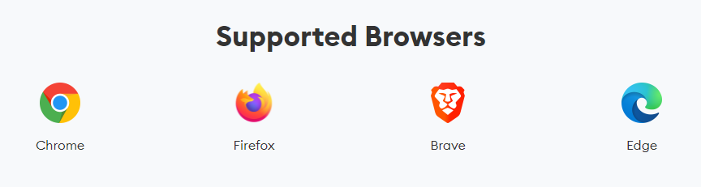
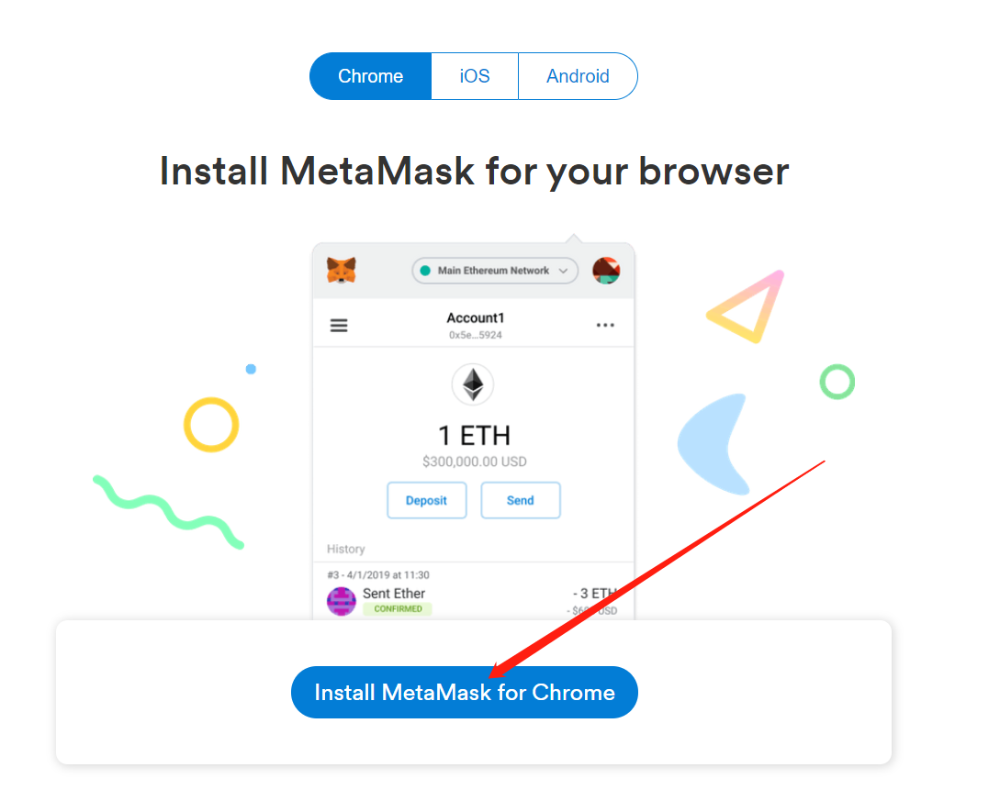
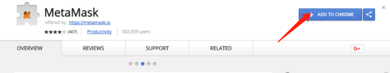
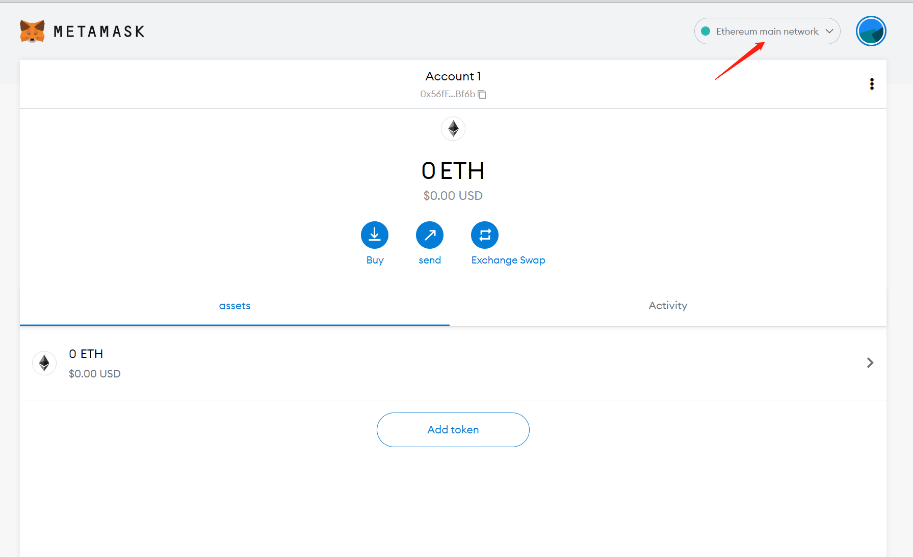

# 🦊 How to install and use Metamask

MetaMask installation Tutorial

> MetaMask is a plug-in type of wallet for Google Chrome. The wallet does not need to be downloaded;  add the corresponding extensions to Google Chrome, very lightweight and straightforward to use

Website：[https://metamask.io/](https://metamask.io)&#x20;

Type: Web browser, Android, iOS&#x20;

Network: ETH, (Including BSC Smart Chain, HECO, and other Ethernet side chains）&#x20;

Supported browsers:  Chrome (Google) browser, Firefox browser, Brave browser、Miscrosoft Edge browser

### 1. Install MetaMask 

Download address：[https://metamask.io/download.html](https://metamask.io/download.html)&#x20;

Select the appropriate browser and go to the corresponding application store to download.&#x20;

> **Access requires Virtual Private Network.**

If you do not have MetaMask yet, it is recommended to install and use it on Chrome, Brave, and other supported browsers.

Please note, it's better to use the official recommended method of installation (The whole process needs a Virtual Private Network)

1. **Click and jump to the installation page.**

For example, to install on Google Chrome, click install MetaMask for Chrome

**2. Jump to Chrome extension store：**

Click to install (ADD TO CHROME). Then a small fox will appear in the top right corner of your browser after you finish the installation.

### 2. Initially set up MetaMask 

1. **Open after installation**

&#x20;After the MetaMask extension is successfully installed on your browser, there will be a MetaMask icon on the extension, then click into

.png>)

If your browser doesn't show it by default, click on extensions (puzzle pieces icon), click on \[Pin] after MetaMask

.png)

**2. Wallet creation**&#x20;

The first time MetaMask users must import their Secret Recovery Phraseor create a new wallet in order to use it.

* Users with existing wallets can import wallets by clicking on "Import Wallet" and typing the Recovery Phrase；
* Users who do not have a wallet or want to create a new one can click "Create a Wallet" to create a new ETH wallet；

.png)

**Import Wallet：**&#x20;

You will need to enter a mnemonic and a new password and check the Terms of Use before clicking "Import."

.png)

**Create a Wallet：**&#x20;

You need to enter the password and reconfirm the same password

.png)

On the next page, you will find your wallet mnemonic (Secret Recovery Phrase)

Please be careful to back up these words (mnemonic) and do not disclose them to others or upload them to the Internet.

**If the mnemonic is compromised, you risk permanent loss of your digital assets.**

Make sure you back up the mnemonic already.

.png)

On this page, you can check the order of the words according to the secret words you have backed up.

.png)

Once all is done, you can use the MetaMask wallet normally

### 3. Set up BSC smart chain network（PC ） 

1. Supported browsers for the MetaMask wallet：

Chrome (Google) browser, Firefox browser, Brave browser、Miscrosoft Edge browser

**Chrome (Google) browser MetaMask Wallet set up tutorial is shown below:**

After logging in to your MetaMask Wallet account, go to the home page and select Home Network in the upper right corner.

**MetaMask wallet** is recognized by default as an Ethereum Mainnet, so we need to create a new Mainnet

Choose "Custom RPC"

.png)

3\. Set up Customized  Network, BSC MAINNET Network

.png)

Follow the steps, enter the following information and click Keep

Network name: BSC Mainnet

PRC URL：[https://bsc-dataseed.binance.org/](https://bsc-dataseed.binance.org)

Chain ID:56

Symbol: BNB

Block browser URL：[https://bscscan.com/](https://bscscan.com)

 (1).png>)

BSC Mainnet is set up already

> After you save it, the next time you click on the little fox in the top right corner of Google Chrome, the BSC MAINNET network selection will appear.

4\. Wallet Switching: Switching from Ethereum Mainnet to BSC smart chain Mainnet

The method of switching is as follows.

Click on the MetaMask Wallet small fox icon in the upper right corner of your browser.

Select the BSC Mainnet we just set up&#x20;

.png)

The BSC Mainnet network link status will appear at the top.

 (1).png>)

If you see this status as the picture above. Congratulations, it is all set.&#x20;

Go back to the homepage of Fish Warrior, after you successfully connect the account section will display as above

