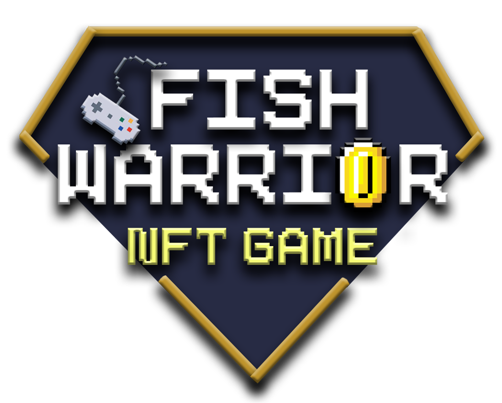
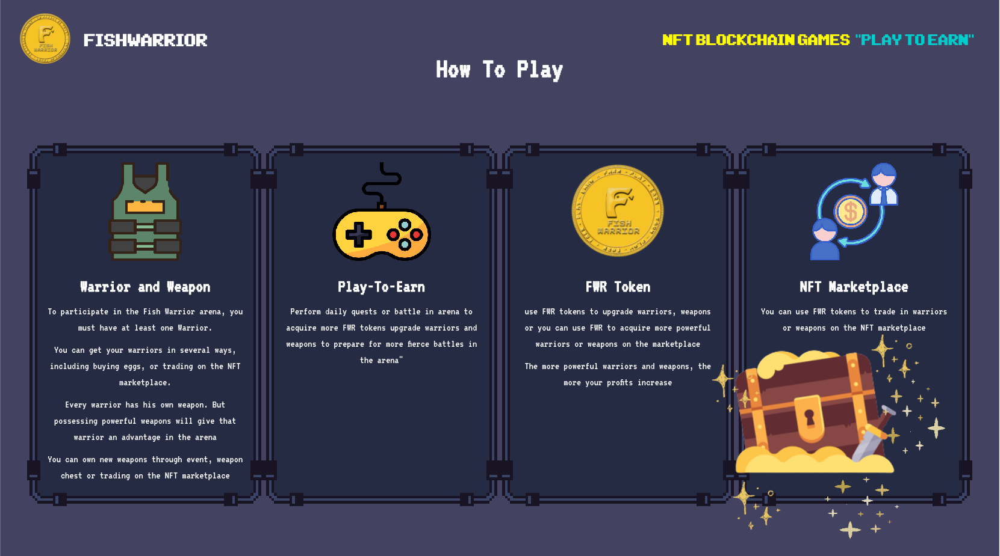

# ⁉ About Fish Warriors

FishWarriors Team is an anonymous global distributed game development and operations team that is deeply committed to the combination of blockchain technology and video games. Our mission is to build a lovely community with our members and anyone can participate in the metaverse community consensus. The community doesn't belong to anyone or an organization, it belongs to the people involved, so we don't have to dedicate any common founding team. The team also participates in gathering ideas from all community members of the game to develop together. We have respected the high efficiency and high execution style and believe that the community and the game will get better and better through everyone's efforts.

Fish Warriors is a pixel fighting game. where players use their warriors to participate in fierce arenas with other players. In addition, players can also manage their armory by upgrading their weapon or decoration character. Not only that, players can also exchange characters or weapons in their armory on the marketplace to generate more profit.

.jpg>)

